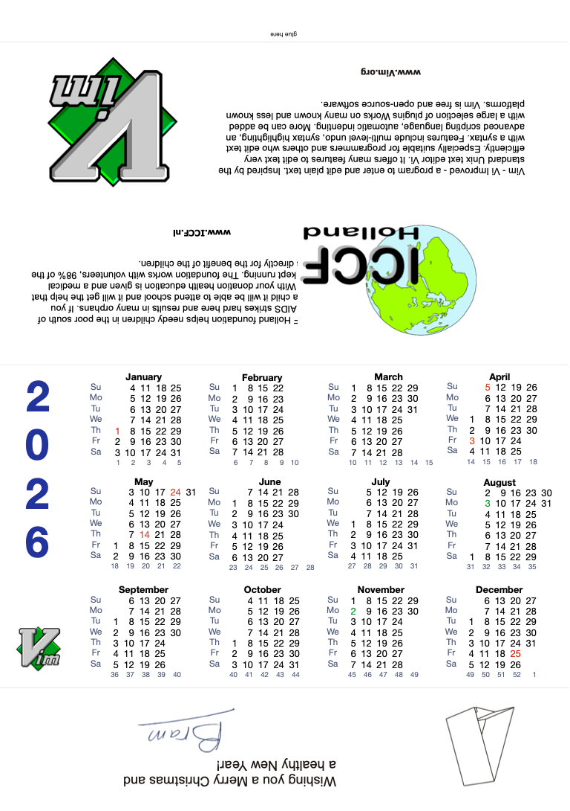

# Vim desktop Calendar

> for Bram Moolenaar （米勒） https://moolenaar.net/#Calendar

A desktop calendar for 2026, made from one sheet of paper. 
After folding, one side contains a useful 12-month calendar. 
On the other side there is brief information about ICCF-Holland, 
and Vim. All files are PDF format, about 628 Kbyte.

**language - paper size** 
[English - A4](https://raw.githubusercontent.com/hotoo/vim-desktop-calendar/main/files/2026_en_a4.pdf) 
English - Letter 
Dutch - A4

 

## 

 

More showcase see [#1](https://github.com/hotoo/vim-desktop-calendar/issues/1) please.

##

[About calendar colors](https://github.com/hotoo/vim-desktop-calendar/wiki)
