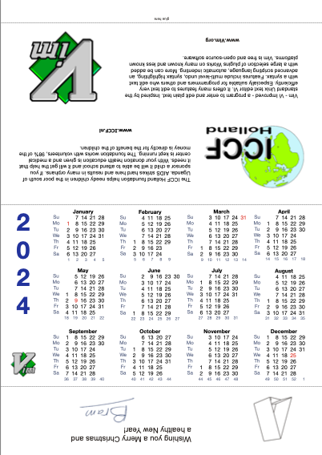

# Vim desktop Calendar

> for https://moolenaar.net/#Calendar

A desktop calendar for 2024, made from one sheet of paper. 
After folding, one side contains a useful 12-month calendar. 
On the other side there is brief information about ICCF-Holland, 
and Vim. All files are PDF format, about 628 Kbyte.

**language - paper size** 
[English - A4](https://github.com/hotoo/printable-vim-calendar/blob/main/2024/2024_en_a4.pdf) 
English - Letter 
Dutch - A4
